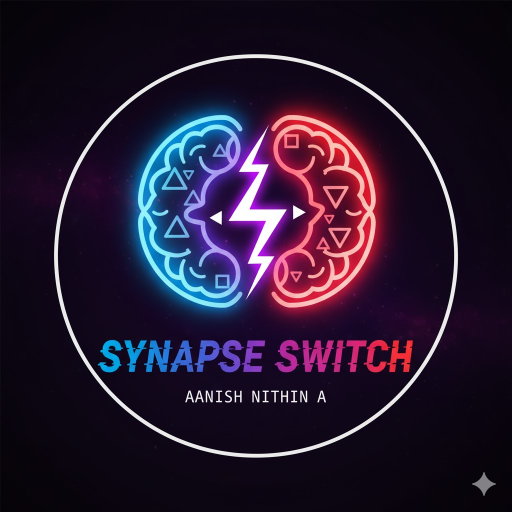

# Synapse Switch

<p align="center">
  
</p>

<p align="center">
  A fast-paced 'left/right brain' game where you must adapt to conflicting rules that 'switch' at any moment.
</p>

<p align="center">
  <a href="https://synapse-switch.vercel.app/">
    
  </a>
</p>

## 🚀 Play the Game

**Ready to test your brain? Play the live version here:**

**[https://synapse-switch.vercel.app/](https://synapse-switch.vercel.app/)**

---

## 🧠 The Motive

**Synapse Switch** is a brain-training game designed to test your cognitive flexibility. Your goal is to fight your brain's instincts by managing two conflicting tasks at once. It's not just about speed—it's about how fast your brain can "rewire" itself.

## 🎮 How to Play

### The Rules
1.  **You control two orbs:** A **Blue Orb** (left) and a **Red Orb** (right).
2.  **Follow the rules:** A rule is displayed for each orb (e.g., "Blue: TRIANGLE").
3.  **Hit your targets:** You **MUST** hit every shape that matches your current rule.
4.  **Avoid the traps:** You **MUST** avoid every shape that does **NOT** match your rule.
5.  **No Mistakes:** Missing a correct shape or hitting an incorrect shape is **GAME OVER**.
6.  **Progressive Challenge:** Every 5 points the game speeds up, and every 30 seconds the rules will **SWITCH!** Stay focused!

### The Controls
* **💻 Desktop:**
    * **"A" key:** Toggles the Blue Orb between lanes.
    * **"Right Arrow" key:** Toggles the Red Orb between lanes.
* **📱 Mobile:**
    * **Tap the Left Pane:** Toggles the Blue Orb between lanes.
    * **Tap the Right Pane:** Toggles the Red Orb between lanes.

### Difficulty Modes
* **Easy:** A gentle start to learn the mechanics. Spawn Rate: 1500ms | Fall Speed: 2500ms
* **Medium:** The standard, challenging experience. Spawn Rate: 1100ms | Fall Speed: 2000ms
* **Hard:** For masters. The game starts fast and gets faster. Spawn Rate: 800ms | Fall Speed: 1500ms

---

## ✨ Features

- 🎯 **Dual-Control Gameplay** - Manage two orbs simultaneously
- ⚡ **Dynamic Rule Switching** - Rules invert every 30 seconds
- 📈 **Progressive Difficulty** - Game speeds up every 5 points
- ⏱️ **Time-Based Challenge** - More obstacles spawn gradually over time
- 📱 **Fully Responsive** - Works seamlessly on desktop and mobile
- 🎨 **Custom Typography** - Beautiful Orbitron and Rajdhani fonts
- 🏆 **High Score Tracking** - Persistent scores via localStorage
- 🎮 **Three Difficulty Modes** - Easy, Medium, and Hard
- 🌈 **Polished UI/UX** - Smooth animations and visual feedback
- 🖼️ **Custom Favicon** - Professional branding

---

## 🛠️ Tech Stack

This game was built from scratch as a single-page web application using:

* **HTML5** - Structure and semantic markup
* **CSS3** - Modern layouts with Flexbox, responsive design, animations
* **Vanilla JavaScript** - Game loop, collision detection, state management
* **Google Fonts** - Orbitron & Rajdhani typography
* **LocalStorage API** - High score persistence

**No frameworks, no libraries - just pure web fundamentals!**

---

## 🚀 Deployment

- **Live Site:** [Vercel](https://synapse-switch.vercel.app/)
- **Repository:** [GitHub](https://github.com/Aanishnithin07/Synapse-Switch)
- **Auto-Deploy:** Pushes to `main` branch trigger automatic deployments

---

## 📂 Project Structure

```
Synapse-Switch/
├── index.html              # Main game file
├── synapse-switch.html     # Backup/development file
├── assets/
│   └── images/
│       ├── favicon-16x16.png
│       ├── favicon-32x32.png
│       ├── apple-touch-icon.png
│       ├── android-chrome-192x192.png
│       └── android-chrome-512x512.png
├── vercel.json             # Vercel deployment config
└── README.md               # You are here!
```

---

## 🎯 Game Mechanics

### Collision Detection
- Precise hit zone detection at orb position
- Real-time collision checking in game loop
- Instant feedback on correct/incorrect hits

### Difficulty Scaling
1. **Score-Based:** Every 5 points reduces spawn rate by 100ms and fall speed by 120ms
2. **Time-Based:** Every minute reduces spawn rate by 50ms (gradual challenge increase)
3. **Combined Effect:** Creates a balanced, progressive difficulty curve

### State Management
- Bulletproof game state tracking
- Clean start/restart/game-over flows
- Animation frame management prevents memory leaks

---

## 👤 Creator

This game was conceptualized, designed, and developed by **AANISH NITHIN A**.

- Creative Vision: Brain-training through cognitive flexibility
- Game Design: Dual-task conflict resolution mechanics
- Technical Implementation: Single-file architecture with zero dependencies
- UI/UX Polish: Responsive design with mobile touch controls

---

## 📜 License

This project is open source and available for educational purposes.

---

## 🎮 Ready to Play?

**Challenge your brain now:** [https://synapse-switch.vercel.app/](https://synapse-switch.vercel.app/)

**Can you beat your high score? Can you survive the SWITCH?** 🧠⚡
